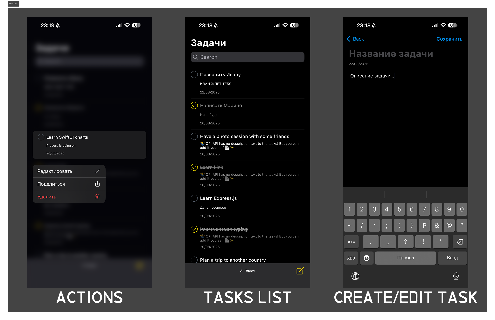

# 📌 ToDoApp — iOS приложение для управления задачами

**ToDoApp** — это UIKit приложение для управления списком задач, построенное с использованием архитектуры **VIPER**, Core Data, NSDiffableDataSource и URLSession.



## 🚀 Основные возможности

### 1. Список задач

* Отображение списка задач на главном экране.
* Каждая задача содержит:

  * название
  * описание
  * дату создания
  * статус (выполнена / не выполнена)
* Возможность:

  * добавления новой задачи
  * редактирования задачи
  * удаления задачи
  * поиска по задачам

### 2. Загрузка данных из API

* При первом запуске приложение загружает список задач с [DummyJSON API](https://dummyjson.com/todos).
* Загруженные задачи автоматически сохраняются в Core Data.

### 3. Многопоточность

* Все операции (создание, загрузка, редактирование, удаление и поиск) выполняются **в фоновом потоке** с использованием **GCD**.
* Пользовательский интерфейс не блокируется при выполнении операций.

### 4. Core Data

* Данные о задачах хранятся в Core Data.
* Приложение корректно восстанавливает сохранённые задачи при повторном запуске.

## 🏗 Архитектура

Проект построен на основе **VIPER**:

* **View** — отвечает за отображение данных.
* **Interactor** — бизнес-логика (работа с Core Data и API).
* **Presenter** — связывает View и Interactor, обрабатывает события.
* **Entity** — модель данных (TaskViewModel).
* **Router** — навигация между экранами.

Такой подход обеспечивает **разделение ответственности**, лёгкость тестирования и расширяемость.

---

## 🚀 Установка и запуск

1. Клонируйте проект:

   ```bash
   git clone https://github.com/maxpnz58/ToDoApp.git
   ```
2. Откройте `.xcodeproj` или `.xcworkspace` в **Xcode 15**.
3. Запустите приложение на симуляторе или устройстве.

---
